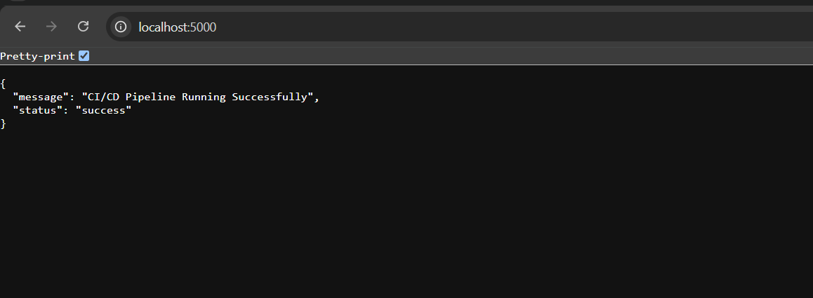

# CI/CD Pipeline Using GitHub Actions and Docker

## Project Overview

This project demonstrates the implementation of a Continuous Integration and Continuous Deployment (CI/CD) pipeline using GitHub Actions and Docker. A simple Flask web application is containerized using Docker, and the build process is automated through GitHub Actions.

## Features

* Automated CI/CD workflow using GitHub Actions
* Dockerized Flask application
* Automatic build execution on every code push
* Dependency management using requirements.txt
* Version control using Git and GitHub

## Technologies Used

* Python
* Flask
* Docker
* GitHub
* GitHub Actions

## Workflow

1. Developer pushes code to GitHub.
2. GitHub Actions workflow is triggered automatically.
3. Dependencies are installed.
4. Docker image is built successfully.
5. Build status is displayed in GitHub Actions.

## Project Structure

ci-cd-devops-project/

├── app.py

├── requirements.txt

├── Dockerfile

└── .github/

    └── workflows/

        └── ci-cd.yml

## Learning Outcomes

* Understanding of CI/CD concepts
* Hands-on experience with GitHub Actions
* Docker containerization
* Workflow automation in DevOps
* Source code management using Git
## Application Output

